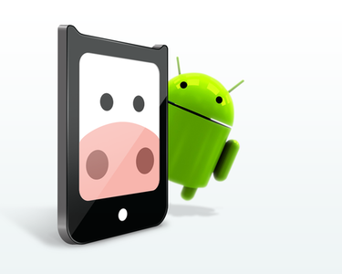

  

# Desenvolvedor Android

Se você curte programar para plataforma Android  
Se você acima de tudo curte desenvolvimento focado em plataformas móveis, independente da linguagem  
Se você é apaixonado por desenvolvimento de software  
Se você curte criar produtos  
Se você não se imagina fazendo outra coisa da sua vida profissional além de escrever código  
Se você está procurando uma empresa inovadora com um ambiente de trabalho descontraído, democrático e divertido

Aqui é seu lugar e nós queremos saber mais sobre você :)

<!--- Atenção aos comentários! São dicas valiosas -->

## Atividades Principais
<!--- Saber IOS é um grande diferencial -->
- Desenvolvimento de aplicativos utilizando o SDK Android 
- Ajudar no desenvolvimento de plataformas auxiliares (App webs, geradoras de conteúdo para os aplicativos);
- Participar do processo de concepção de arquitetura de novos aplicativos;

## Requisitos

- Experiência em desenvolvoimento Java utilizando SDK Android
- Comunicativo e com fácil relacionamento;
- <strong>Apaixonado por desenvolvimento de software.</strong>
- Já ter publicado ao menos uma app na Android Market
- Experiência com Git

<!--- Ser um bom jogador de CS ou FIFA é quase um requisito -->

## Diferenciais

- Experiência com outra linguagem de programação;
- Experiência com desenvolvimento Web;
- Habilidades em FIFA e CS, e conhecimento de cervejas.

## Sobre a empresa

- A Moobile possui um ambiente amigável e divertido. Somos 2 desenvolvedores, uma designer e um cara de produto,
aprendendo e interagindo diariamente. Temos todas as vantagens de ser pequenos e uma estrutura de empresa grande
(graças à nossa investidora) o que faz com que nos concentremos no que importa: resolver os problemas das pessoas
através da tecnologia.

É uma missão difícil e esperamos que você venha nos ajudar a criar aplicações digitais que tenham impacto no mundo. 
Topa?

- A Moobile, faz parte do grupo Innvent que tem como filosofia propor um lugar onde pessoas incríveis combinam suas competências para
  fazer inovação. 
  Contando com grande experiência em gestão e tecnologia, além
  de uma equipe altamente qualificada, a Innvent possui uma atuação *hands-on*
  desenvolvendo, acelerando e alavancando negócios e startups. Ao todo, somos 15
  empresas, 200 pessoas e estamos presentes em 4 cidades;
- A ELO Group, principal empresa do grupo, foi eleita a [2ª melhor empresa para
  se trabalhar no Rio de Janeiro](http://www.greatplacetowork.com.br/melhores-empresas/gptw-rio-de-janeiro/815-2013)
  e [12ª melhor empresa do Brasil para se trabalhar com TI](http://www.greatplacetowork.com.br/melhores-empresas/gptw-ti-a-telecom/819-2013)
  (GPTW 2013);
- Nosso ambiente de trabalho é 100% descontraído com muito incentivo aocrescimento profissional.

<!--- Além disso, figuramos em primeiro lugar em TI como a empresa com mais
jovens e como a 9ª em TI com maior escolaridade.  -->

  

- Local: [Av. Graça Aranha, 128, 2º andar - Centro - Rio de Janeiro](https://maps.google.com.br/maps?q=Av.+Gra%C3%A7a+Aranha,+128+-+Centro+-+Rio+de+Janeiro&ie=UTF8&hnear=Av.+Gra%C3%A7a+Aranha,+128+-+Centro,+Rio+de+Janeiro,+20030-000&gl=br&t=m&z=16).

## Contato

Caso deseje se canditar nos envie um *pull request* nesse repositório.
Referencie outros *pull requests* ou projetos que você tenha orgulho. Mas acima
de tudo, **nos surpreenda**!

Se preferir um contato mais privado, envie um email para contato@moobile.com.br
com assunto: “Dev Android”.

<!--- Ter lido esse código-fonte pode ser um diferencial :p Nos deixe saber!
Quando for enviar seu currículo, se identifique escrevendo "Currículo Monstro"
no assunto. Boa sorte! -->
